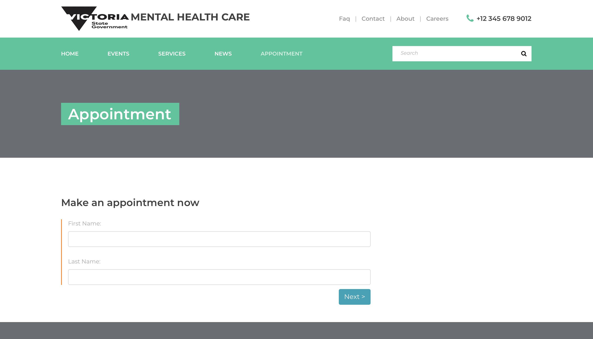
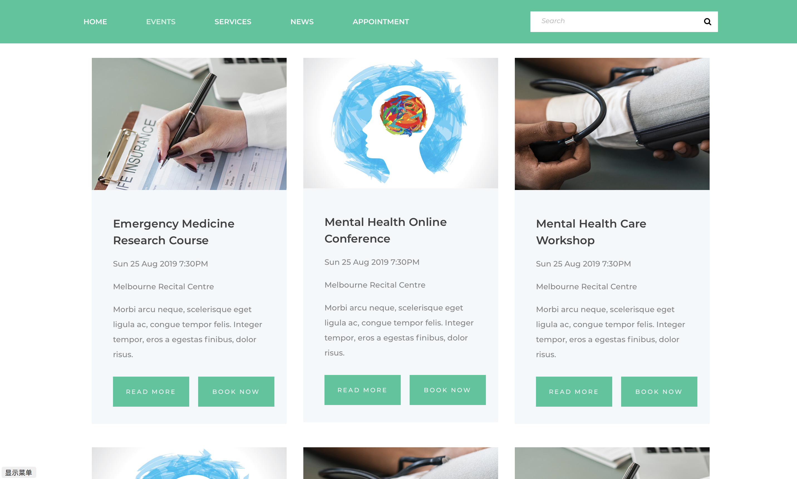

# MentalHealthCare
<table>
<tr>
<td>
  Mental Health Care is a static site for a fictitious mental health care government org. It includes standard retinue of About, Contact, Faq, Events, News, Services, Appointment, etc. Appointment includes a multi-step form.
</td>
</tr>
</table>

## Demo

Here is a working live demo :  https://mentalhealthcare.herokuapp.com/

## Screenshots

### Main Page

### Appointment Page

### Event Page

## Usage

Open ***home.html*** with a browser.

## Built with 

- HTML
- CSS
- JavaScript
- Bootstrap
- Template is used from https://colorlib.com/